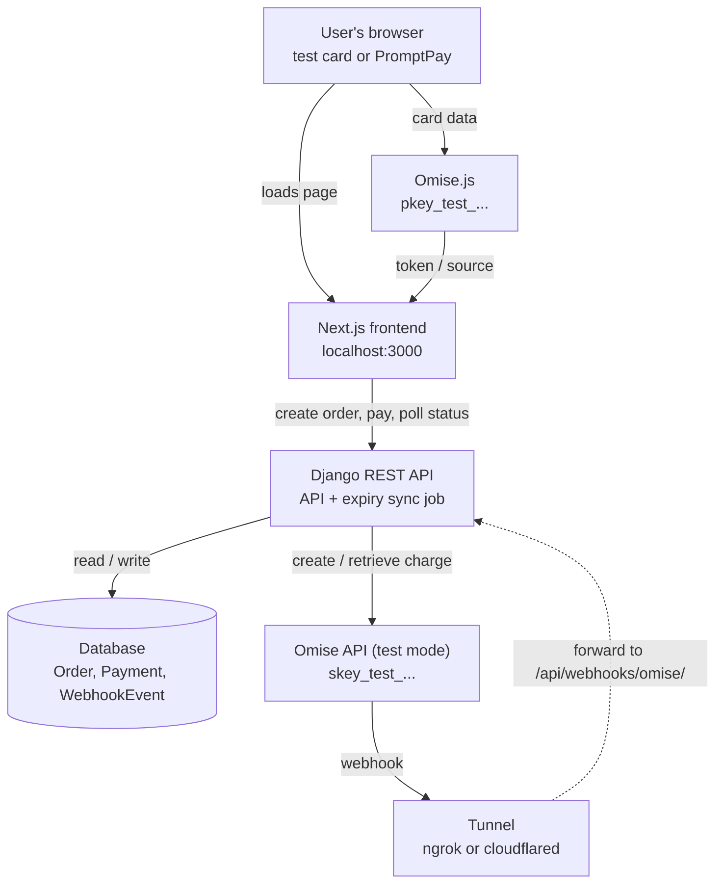
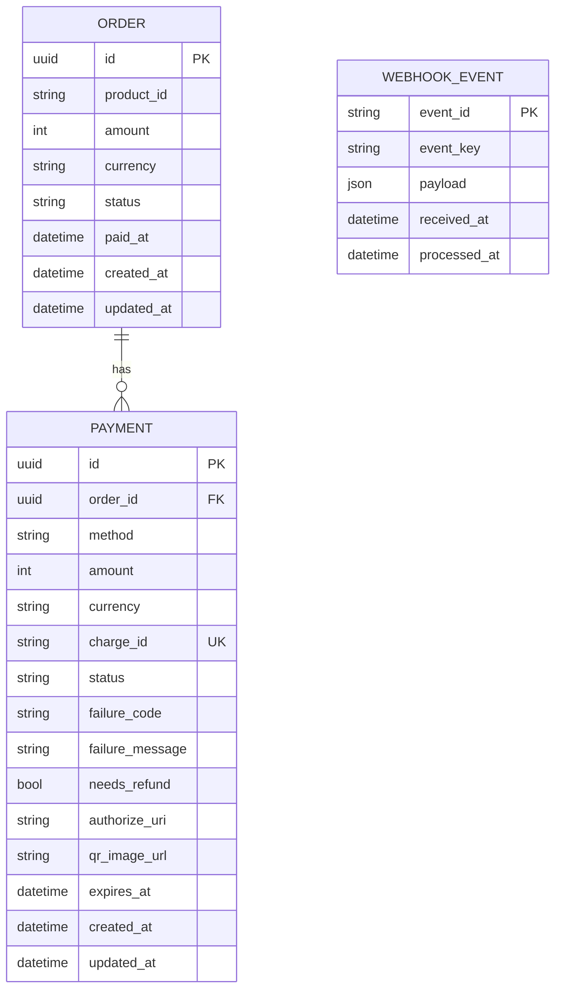
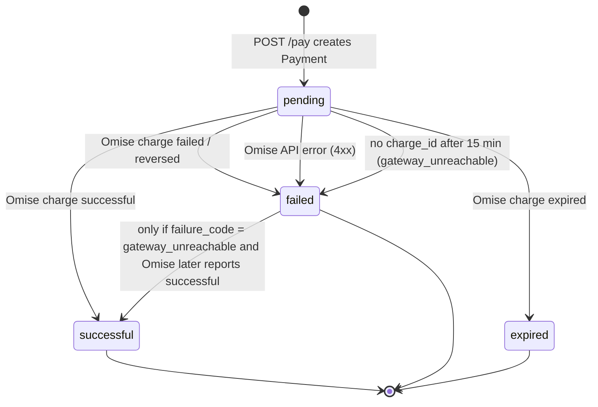
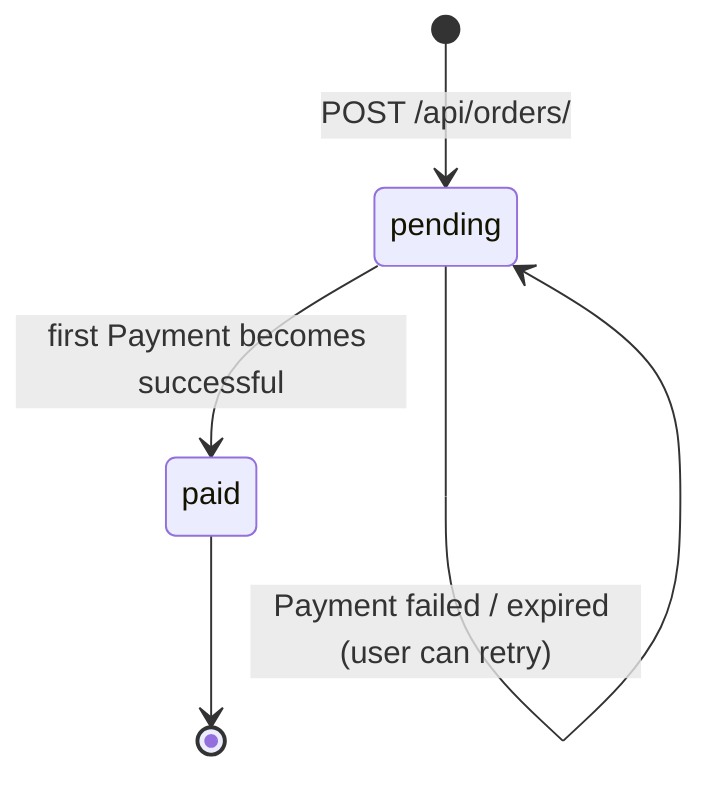
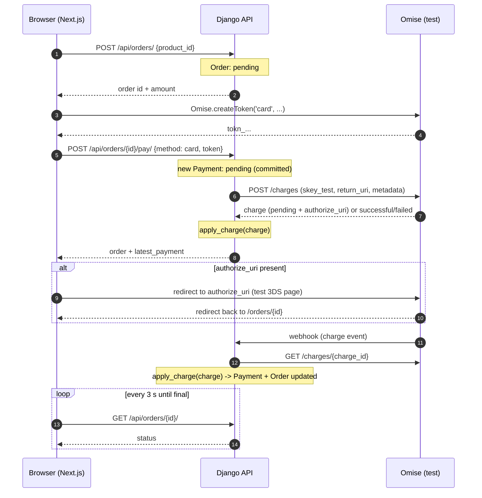
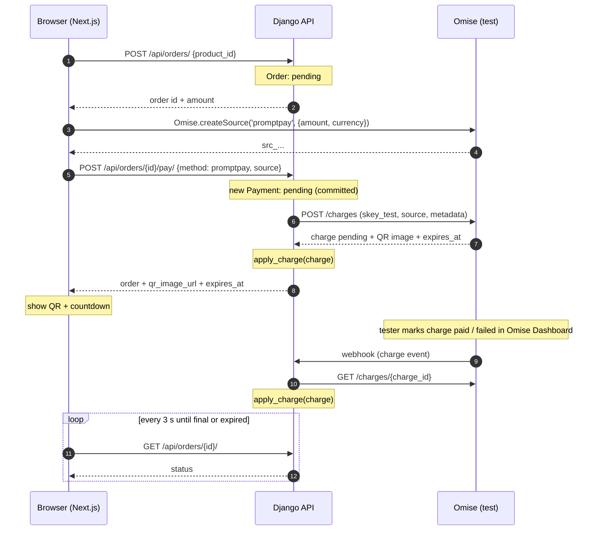

# Payment System Architecture: Next.js + Django REST API + Omise (Test Mode)

เอกสารนี้อธิบายสถาปัตยกรรมระบบชำระเงินแบบครบ flow สำหรับการเรียนรู้ ใช้ Omise (Opn Payments) ใน **test mode เท่านั้น** ไม่มีการตัดเงินจริง และไม่มีค่าใช้จ่าย

แนวคิดหลักเป็นรูปแบบมาตรฐานที่ใช้ในระบบจริง ได้แก่ client-side tokenization, server-side charge, webhook และการตรวจสอบกับ gateway ส่วนที่ตัดออกเพื่อความเรียบง่ายระบุไว้ในหัวข้อ 15

---

## สารบัญ

1. [ขอบเขต](#1-ขอบเขต)
2. [Tech stack](#2-tech-stack)
3. [ภาพรวมระบบ](#3-ภาพรวมระบบ)
4. [Keys และ environment variables](#4-keys-และ-environment-variables)
5. [Data model](#5-data-model)
6. [State machine](#6-state-machine)
7. [API specification](#7-api-specification)
8. [Payment flows](#8-payment-flows)
9. [Charge processing: `apply_charge`](#9-charge-processing-apply_charge)
10. [Webhook processing](#10-webhook-processing)
11. [Expiry sync job](#11-expiry-sync-job)
12. [Frontend (Next.js)](#12-frontend-nextjs)
13. [Omise integration reference](#13-omise-integration-reference)
14. [Security rules](#14-security-rules)
15. [สิ่งที่อยู่นอกขอบเขต](#15-สิ่งที่อยู่นอกขอบเขต)
16. [Local development](#16-local-development)
17. [Test scenarios](#17-test-scenarios)
18. [สิ่งที่ต้องตรวจกับเอกสาร Omise](#18-สิ่งที่ต้องตรวจกับเอกสาร-omise)
19. [โครงสร้างโฟลเดอร์ที่แนะนำ](#19-โครงสร้างโฟลเดอร์ที่แนะนำ)

---

## 1. ขอบเขต

### อยู่ในขอบเขต

- ซื้อสินค้า 1 ชิ้นต่อ 1 order โดยใช้รายการสินค้าที่กำหนดไว้ใน backend
- ชำระด้วย **บัตร** (รองรับ 3D Secure) และ **PromptPay** (QR)
- 1 order ลองจ่ายได้หลายครั้ง แต่สำเร็จได้ครั้งเดียว
- รับผลการชำระเงินผ่าน webhook และตรวจสอบกับ Omise ซ้ำ
- จัดการ payment ที่หมดอายุด้วย scheduled job
- ตรวจจับการจ่ายซ้ำ (duplicate payment) และทำเครื่องหมายว่าต้องคืนเงิน

### นอกขอบเขต

- ระบบผู้ใช้และ login
- ตะกร้าสินค้าหลายชิ้น
- การคืนเงินผ่าน API (ทำด้วยมือใน Omise Dashboard)
- live mode และการตัดเงินจริง

---

## 2. Tech stack

| ส่วน | เทคโนโลยี | หมายเหตุ |
|---|---|---|
| Frontend | Next.js 16 (App Router) + TypeScript (strict) | รันที่ `http://localhost:3000`, ใช้ pnpm, TypeScript 6.0.x (typescript-eslint ยังไม่รองรับ 7) |
| Payment SDK (client) | Omise.js | โหลดจาก `https://cdn.omise.co/omise.js` |
| Backend | Django + Django REST Framework | รันที่ `http://localhost:8000` |
| HTTP client (backend) | `requests` | เรียก Omise REST API ตรงๆ |
| CORS | `django-cors-headers` | อนุญาตเฉพาะ `FRONTEND_URL` |
| Database | PostgreSQL 18 (`postgres:18.6-alpine`) | รันใน Docker ด้วย `django/docker-compose.yml`, Django ต่อผ่าน `psycopg[binary]` |
| DB admin | pgAdmin 4 (`dpage/pgadmin4:9.17`) | รันใน Docker ตัวเดียวกัน เปิดที่ `http://localhost:5050` |
| Payment gateway | Omise test mode | ใช้ key ที่ขึ้นต้นด้วย `pkey_test_` / `skey_test_` |
| Tunnel | ngrok หรือ cloudflared | ใช้รับ webhook เข้า localhost |
| Scheduler | cron หรือรันด้วยมือ | ใช้รัน `sync_pending_payments` |

ทุกอย่างไม่มีค่าใช้จ่าย ngrok ต้องสมัครบัญชีฟรี ส่วน cloudflared แบบ quick tunnel ไม่ต้องสมัคร

---

## 3. ภาพรวมระบบ



### หน้าที่ของแต่ละส่วน

| ส่วน | หน้าที่ | ห้ามทำ |
|---|---|---|
| Next.js | แสดงสินค้า, หน้า checkout, เรียก Omise.js, แสดง QR, redirect ไป 3DS, ถามสถานะ order | ห้ามคำนวณยอดเงิน, ห้ามถือ secret key, ห้ามตัดสินว่าจ่ายสำเร็จเอง |
| Omise.js | รับข้อมูลบัตรแล้วส่งไป Omise โดยตรง คืน `tokn_...` หรือ `src_...` | — |
| Django API | สร้าง order, คำนวณยอดเงิน, สร้าง Payment และ charge, รับ webhook, อัปเดตสถานะ | ห้ามรับหรือเก็บเลขบัตร, ห้ามเชื่อ body ของ webhook โดยไม่ตรวจสอบ |
| Database | เก็บ Order, Payment, WebhookEvent | ห้ามเก็บข้อมูลบัตร |
| Omise | tokenization, ประมวลผล charge, 3DS, QR, ส่ง webhook | — |
| Tunnel | เปิด URL สาธารณะให้ Omise ส่ง webhook เข้า localhost | ใช้เฉพาะตอนพัฒนา |

**หลักสำคัญ:** Omise คือ source of truth ของสถานะการชำระเงิน Django ไม่ตัดสินสถานะเอง แต่คัดลอกสถานะจาก charge ที่ดึงมาจาก Omise API ด้วย secret key เท่านั้น มีข้อยกเว้นเดียวคือกรณีที่เรียก Omise ไม่สำเร็จ (ดูหัวข้อ 7.2 และ 11)

---

## 4. Keys และ environment variables

### Backend (`django/.env`)

| ตัวแปร | ตัวอย่าง | หมายเหตุ |
|---|---|---|
| `DJANGO_SECRET_KEY` | `change-me` | |
| `DEBUG` | `True` | |
| `ALLOWED_HOSTS` | `localhost,127.0.0.1,.ngrok-free.app,.trycloudflare.com` | ต้องรวมโดเมนของ tunnel |
| `OMISE_SECRET_KEY` | `skey_test_...` | **ห้าม** ส่งไป frontend |
| `OMISE_API_BASE` | `https://api.omise.co` | |
| `FRONTEND_URL` | `http://localhost:3000` | ใช้กับ CORS และ `return_uri` |
| `POSTGRES_DB` | `payments` | ต้องตรงกับ `django/pgadmin/servers.json` |
| `POSTGRES_USER` | `payments` | ต้องตรงกับ `django/pgadmin/servers.json` |
| `POSTGRES_PASSWORD` | (สุ่ม) | |
| `POSTGRES_HOST` | `localhost` | Django รันบนเครื่อง ต่อเข้า container ผ่าน port ที่ map ไว้ |
| `POSTGRES_PORT` | `5432` | ใช้ทั้งกับ Django และ port ของ container |
| `PGADMIN_DEFAULT_EMAIL` | `admin@example.com` | pgAdmin ไม่รับโดเมนอย่าง `.local` |
| `PGADMIN_DEFAULT_PASSWORD` | (สุ่ม) | |
| `PGADMIN_PORT` | `5050` | |

`docker compose` อ่าน `django/.env` ไฟล์เดียวกับ Django แต่ส่งเข้า container เฉพาะตัวแปร `POSTGRES_*` และ `PGADMIN_*` ที่ระบุใน compose เท่านั้น `OMISE_SECRET_KEY` จึงไม่เข้าไปใน container

### การเชื่อมต่อระหว่าง service (ค่าที่ต้องตรงกัน)

| จาก | ไป | ค่าฝั่งต้นทาง | ต้องตรงกับ |
|---|---|---|---|
| Browser (Next.js) | Django | `NEXT_PUBLIC_API_BASE_URL=http://localhost:8000` | `runserver 8000` และ `localhost` อยู่ใน `ALLOWED_HOSTS` |
| Django (CORS) | Browser | `FRONTEND_URL=http://localhost:3000` | origin ของ `pnpm dev` (ห้ามมี `/` ท้าย) |
| Django | PostgreSQL | `POSTGRES_HOST=localhost`, `POSTGRES_PORT=5432` | port ที่ compose map ไว้ (`127.0.0.1:${POSTGRES_PORT}:5432`) |
| pgAdmin | PostgreSQL | `servers.json`: `Host=db`, `Port=5432` | ชื่อ service `db` ใน compose (ใช้ port ภายใน network ของ Docker เสมอ) |

- `NEXT_PUBLIC_*` ถูกฝังตอน build/start ของ Next.js ต้อง restart `pnpm dev` หลังแก้ `.env.local`
- Django รันบนเครื่อง (ไม่อยู่ใน Docker) จึงใช้ `localhost` ไม่ใช่ `db`

### Frontend (`nextjs/.env.local`)

| ตัวแปร | ตัวอย่าง | หมายเหตุ |
|---|---|---|
| `NEXT_PUBLIC_OMISE_PUBLIC_KEY` | `pkey_test_...` | public key เปิดเผยได้ |
| `NEXT_PUBLIC_API_BASE_URL` | `http://localhost:8000` | |

### Test-mode guard (บังคับ)

- ตอน Django เริ่มทำงาน ถ้า `OMISE_SECRET_KEY` ไม่ขึ้นต้นด้วย `skey_test_` ให้ raise `ImproperlyConfigured` แล้วหยุดทำงาน
- ฝั่ง Next.js ถ้า `NEXT_PUBLIC_OMISE_PUBLIC_KEY` ไม่ขึ้นต้นด้วย `pkey_test_` ให้แสดง error และไม่โหลดหน้า checkout
- ข้อนี้รับประกันว่าระบบจะไม่ตัดเงินจริงแม้ใส่ key ผิด
- `.env` และ `.env.local` ต้องอยู่ใน `.gitignore`

---

## 5. Data model

### 5.1 ความสัมพันธ์



### 5.2 Product catalog (ไม่ใช่ตาราง)

กำหนดไว้ในโค้ด backend เพื่อให้ backend เป็นผู้กำหนดราคาเสมอ

```python
PRODUCTS = {
    "coffee": {"name": "Coffee", "amount": 6000},   # 60.00 THB
    "cake":   {"name": "Cake",   "amount": 12000},  # 120.00 THB
}
```

- `amount` มีหน่วยเป็นสตางค์ (1 บาท = 100 สตางค์) และเป็นจำนวนเต็มเสมอ
- ห้ามใช้ `float`
- ทุกราคาต้องไม่ต่ำกว่ายอดขั้นต่ำของ Omise (ดูหัวข้อ 18)

### 5.3 `Order`

| Field | Django type | Constraint | ความหมาย |
|---|---|---|---|
| `id` | `UUIDField(primary_key=True, default=uuid4)` | | ใช้ UUID เพื่อไม่ให้เดา ID ของ order คนอื่นได้ เพราะไม่มีระบบ login |
| `product_id` | `CharField(max_length=50)` | ต้องมีอยู่ใน `PRODUCTS` | |
| `amount` | `PositiveIntegerField` | | ยอดเงินเป็นสตางค์ คัดลอกจาก `PRODUCTS` ตอนสร้าง |
| `currency` | `CharField(max_length=3, default="thb")` | | |
| `status` | `CharField(choices=["pending", "paid"])` | default `pending` | |
| `paid_at` | `DateTimeField(null=True)` | | เวลาที่เปลี่ยนเป็น `paid` |
| `created_at` | `DateTimeField(auto_now_add=True)` | | |
| `updated_at` | `DateTimeField(auto_now=True)` | | |

### 5.4 `Payment`

แต่ละแถวคือการพยายามจ่าย 1 ครั้ง ต่อ 1 charge ของ Omise

| Field | Django type | Constraint | ความหมาย |
|---|---|---|---|
| `id` | `UUIDField(primary_key=True, default=uuid4)` | | ส่งไปใน charge `metadata.payment_id` |
| `order` | `ForeignKey(Order, on_delete=PROTECT, related_name="payments")` | | |
| `method` | `CharField(choices=["card", "promptpay"])` | | |
| `amount` | `PositiveIntegerField` | | คัดลอกจาก `order.amount` |
| `currency` | `CharField(max_length=3)` | | คัดลอกจาก `order.currency` |
| `charge_id` | `CharField(max_length=64, unique=True, null=True, blank=True)` | unique | `null` ระหว่างที่ยังไม่ได้ charge กลับมาจาก Omise |
| `status` | `CharField(choices=["pending", "successful", "failed", "expired"])` | default `pending` | |
| `failure_code` | `CharField(null=True, blank=True)` | | เช่น `insufficient_fund`, `gateway_unreachable` |
| `failure_message` | `TextField(null=True, blank=True)` | | ข้อความสำหรับแสดงผู้ใช้ |
| `needs_refund` | `BooleanField(default=False)` | | `True` เมื่อสำเร็จซ้ำกับ order ที่จ่ายแล้ว |
| `authorize_uri` | `URLField(max_length=2048, null=True, blank=True)` | | URL ของหน้า 3DS (เฉพาะบัตร) |
| `qr_image_url` | `URLField(max_length=2048, null=True, blank=True)` | | URL รูป QR (เฉพาะ PromptPay) |
| `expires_at` | `DateTimeField(null=True, blank=True)` | | คัดลอกจาก charge ของ Omise |
| `created_at` | `DateTimeField(auto_now_add=True)` | | |
| `updated_at` | `DateTimeField(auto_now=True)` | | |

**Database constraint:** order หนึ่งมี payment ที่สำเร็จและไม่ต้องคืนเงินได้ไม่เกิน 1 รายการ

```python
models.UniqueConstraint(
    fields=["order"],
    condition=Q(status="successful", needs_refund=False),
    name="one_effective_successful_payment_per_order",
)
```

**Index ที่แนะนำ:** `(status, expires_at)` สำหรับ sync job (ชื่อ `payment_status_expires_idx`)

**Constraint เพิ่มเติมที่ใช้ในโค้ด** (กันข้อมูลผิดที่ระดับฐานข้อมูล):

| ชื่อ | ตาราง | เงื่อนไข |
|---|---|---|
| `order_status_valid` | Order | `status` อยู่ใน `pending`, `paid` |
| `order_paid_has_paid_at` | Order | `status = pending` หรือ `paid_at` ไม่เป็น `null` |
| `payment_status_valid` | Payment | `status` อยู่ใน 4 ค่าของหัวข้อ 6.1 |
| `payment_method_valid` | Payment | `method` อยู่ใน `card`, `promptpay` |
| `payment_refund_only_when_successful` | Payment | `needs_refund = False` หรือ `status = successful` |

- choices เป็น `TextChoices` ระดับ module: `OrderStatus`, `PaymentStatus`, `PaymentMethod` ใน `payments/models.py`
- `status` และ `method` ใช้ `max_length=16`, `failure_code` ใช้ `max_length=255`

### 5.5 `WebhookEvent`

| Field | Django type | Constraint | ความหมาย |
|---|---|---|---|
| `event_id` | `CharField(max_length=64, primary_key=True)` | unique | `id` ของ event จาก Omise (`evnt_...`) |
| `event_key` | `CharField(max_length=64)` | | เช่น `charge.complete` |
| `payload` | `JSONField` | | body ดิบ เก็บไว้ debug |
| `received_at` | `DateTimeField(auto_now_add=True)` | | |
| `processed_at` | `DateTimeField(null=True, blank=True)` | | `null` = ยังประมวลผลไม่สำเร็จ |

---

## 6. State machine

### 6.1 Payment



| จาก | ไป | เงื่อนไข | ผู้เปลี่ยน |
|---|---|---|---|
| — | `pending` | สร้าง Payment ใน `/pay` | `/pay` |
| `pending` | `successful` | charge จาก Omise มี `status = successful` | `apply_charge` |
| `pending` | `failed` | charge มี `status = failed` หรือ `reversed` | `apply_charge` |
| `pending` | `failed` | Omise ตอบ error 4xx ตอนสร้าง charge (ไม่มี charge เกิดขึ้น) | `/pay` |
| `pending` | `failed` | `charge_id` เป็น `null` นานเกิน 15 นาที | sync job |
| `pending` | `expired` | charge มี `status = expired` | `apply_charge` |
| `failed` (`gateway_unreachable`) | `successful` | ภายหลังพบว่า charge เกิดขึ้นจริงและสำเร็จ | `apply_charge` |

**กฎ:**

- `successful` และ `expired` เป็นสถานะสุดท้าย เปลี่ยนต่อไม่ได้
- `failed` เป็นสถานะสุดท้าย ยกเว้นกรณี `failure_code = gateway_unreachable`
- Payment ที่เป็น `failed` + `gateway_unreachable` เปลี่ยนได้แค่ไป `successful` ถ้า charge ยังเป็น `pending`, `failed` หรือ `expired` ให้คงสถานะ `failed` และคง `failure_code = gateway_unreachable` ไว้ (ไม่เขียนทับด้วยค่าจาก charge) เพื่อไม่ให้ข้อยกเว้นนี้หายไป
- `needs_refund` เป็น flag แยกจาก `status` ถูกตั้งตอนเปลี่ยนเป็น `successful` ในขณะที่ order เป็น `paid` อยู่แล้ว

### 6.2 Order



| จาก | ไป | เงื่อนไข |
|---|---|---|
| — | `pending` | สร้าง order |
| `pending` | `paid` | Payment ตัวแรกของ order เปลี่ยนเป็น `successful` และตั้ง `paid_at = now()` |

**กฎ:**

- `paid` เป็นสถานะสุดท้าย
- Payment ที่ `failed` หรือ `expired` จะไม่เปลี่ยนสถานะ order ผู้ใช้ลองจ่ายใหม่ได้

---

## 7. API specification

**ข้อกำหนดทั่วไป**

- ทุก path ลงท้ายด้วย `/` ให้ตรงกับ `APPEND_SLASH` ของ Django
- body และ response เป็น JSON
- ตั้ง `DEFAULT_AUTHENTICATION_CLASSES = []` และ `DEFAULT_PERMISSION_CLASSES = [AllowAny]` ใน DRF เพราะไม่มี login ข้อนี้ทำให้ไม่มีปัญหา CSRF จาก `SessionAuthentication`
- error ใช้รูปแบบเดียวกันทั้งหมด:

```json
{ "error": { "code": "order_already_paid", "message": "This order has already been paid." } }
```

### 7.1 `POST /api/orders/`

สร้าง order ใหม่

**Request**

```json
{ "product_id": "coffee" }
```

**Logic**

1. ถ้า `product_id` ไม่อยู่ใน `PRODUCTS` ตอบ `400 invalid_product`
2. สร้าง `Order(product_id, amount=PRODUCTS[id]["amount"], currency="thb", status="pending")`

**Response `201`**

```json
{
  "id": "3f6c2a8e-6f0b-4a51-9a64-0f6b8d7f2c11",
  "product_id": "coffee",
  "product_name": "Coffee",
  "amount": 6000,
  "currency": "thb",
  "status": "pending",
  "latest_payment": null
}
```

frontend ห้ามส่ง `amount` มา ถ้าส่งมาต้องไม่ถูกนำไปใช้

response ของ 7.1, 7.2 และ 7.3 สร้างจาก `serialize_order()` ใน `payments/serializers.py` ตัวเดียวกัน จึงมี field ครบเท่ากันทุกครั้ง (รวม `paid_at`) ตัวอย่างใน 7.1 และ 7.2 แสดงแค่บางส่วน

เฉพาะกรณีที่สำเร็จ (`200` และ `201`) เท่านั้นที่คืน object ของ order ส่วน `402` และ `502` ใช้รูปแบบ error มาตรฐาน `{"error": {...}}` เหมือน endpoint อื่น โดย `402` ใส่ `message` จาก Omise มาให้ ฝั่ง frontend จะดึง order ใหม่เองเพื่อเอา `failure_message` ที่บันทึกไว้ (หัวข้อ 12.3)

### 7.2 `POST /api/orders/{order_id}/pay/`

สร้าง Payment และสร้าง charge ที่ Omise

**Request (บัตร)**

```json
{ "method": "card", "token": "tokn_test_..." }
```

**Request (PromptPay)**

```json
{ "method": "promptpay", "source": "src_test_..." }
```

**Validation**

| เงื่อนไข | Response |
|---|---|
| ไม่พบ order | `404 order_not_found` |
| `method` ไม่ใช่ `card` หรือ `promptpay` | `400 invalid_method` |
| `method = card` แต่ `token` ไม่ขึ้นต้นด้วย `tokn_` | `400 invalid_token` |
| `method = promptpay` แต่ `source` ไม่ขึ้นต้นด้วย `src_` | `400 invalid_source` |
| `order.status = paid` | `409 order_already_paid` |

**Logic** (ล็อก order ด้วย `select_for_update` ตลอดขั้นตอน 1–3 เพื่อกันการกดซ้ำพร้อมกัน)

1. **Validate** ตามตารางด้านบน
2. **Reuse:** หา Payment ของ order นี้ที่ตรงทุกข้อต่อไปนี้
   - `status = pending`
   - `method` ตรงกับ request
   - `charge_id` ไม่เป็น `null`
   - `expires_at` เป็น `null` หรือมากกว่าเวลาปัจจุบัน

   ถ้าพบ ให้คืน Payment นั้นด้วย `200` โดยไม่สร้าง charge ใหม่ ข้อนี้กันการกดปุ่มซ้ำแล้วถูกตัดเงินสองรอบ
3. **Create:** สร้าง `Payment(order, method, amount=order.amount, currency=order.currency, status="pending")` แล้ว commit ก่อนเรียก Omise
4. **เรียก Omise** `POST /charges` (ดูหัวข้อ 13.2) โดยส่ง
   - `amount`, `currency` จาก Payment
   - `card` หรือ `source`
   - `return_uri = {FRONTEND_URL}/orders/{order_id}` (สำหรับ 3DS)
   - `metadata[order_id]` และ `metadata[payment_id]`
   - timeout 30 วินาที
5. **จัดการผลลัพธ์**

| ผลจาก Omise | สิ่งที่ทำ | Response |
|---|---|---|
| 2xx ได้ charge object | เรียก `apply_charge(charge)` (หัวข้อ 9) | `201` พร้อมข้อมูล order |
| 4xx พร้อม error object | Payment เป็น `failed`, ตั้ง `failure_code` และ `failure_message` จาก Omise | `402 payment_failed` พร้อมข้อมูล order |
| timeout, network error หรือ 5xx | Payment คงเป็น `pending` และ `charge_id = null` แล้ว log error (sync job หรือ webhook จะจัดการต่อ) | `502 gateway_unavailable` |

> **ข้อควรระวัง (ยังไม่ได้แก้ในสเปก):** กฎ reuse ในข้อ 2 ไม่นับ Payment ที่ `charge_id = null` ถ้าผู้ใช้กดจ่ายใหม่ทันทีหลัง `502` ระบบจะสร้าง Payment และ charge ใหม่ ซึ่งอาจตัดเงินซ้ำถ้า charge แรกเกิดขึ้นจริง (สุดท้ายจะถูกจับได้เป็น `needs_refund`) ตอนนี้ frontend เตือนให้ตรวจสอบสถานะก่อนลองใหม่ (หัวข้อ 12.3) ทางแก้ฝั่ง backend ที่เป็นไปได้คือใช้ idempotency key ของ Omise ซึ่งต้องตรวจก่อนตามหัวข้อ 18

**Response `201` (บัตรที่ต้องทำ 3DS)**

```json
{
  "id": "3f6c2a8e-...",
  "amount": 6000,
  "currency": "thb",
  "status": "pending",
  "latest_payment": {
    "id": "9b1d...",
    "method": "card",
    "status": "pending",
    "authorize_uri": "https://...",
    "qr_image_url": null,
    "expires_at": "2026-09-15T10:30:00Z",
    "failure_code": null,
    "failure_message": null
  }
}
```

**Response `201` (PromptPay)**

```json
{
  "id": "3f6c2a8e-...",
  "status": "pending",
  "latest_payment": {
    "method": "promptpay",
    "status": "pending",
    "authorize_uri": null,
    "qr_image_url": "https://...",
    "expires_at": "2026-09-15T10:30:00Z"
  }
}
```

**Response `201` (บัตรที่สำเร็จทันทีโดยไม่มี 3DS)**

```json
{ "id": "3f6c2a8e-...", "status": "paid", "latest_payment": { "method": "card", "status": "successful" } }
```

### 7.3 `GET /api/orders/{order_id}/`

อ่านสถานะ order เป็น read-only ไม่เรียก Omise

**Response `200`**

```json
{
  "id": "3f6c2a8e-...",
  "product_id": "coffee",
  "product_name": "Coffee",
  "amount": 6000,
  "currency": "thb",
  "status": "pending",
  "paid_at": null,
  "latest_payment": {
    "id": "9b1d...",
    "method": "promptpay",
    "status": "expired",
    "authorize_uri": null,
    "qr_image_url": "https://...",
    "expires_at": "2026-09-15T10:30:00Z",
    "failure_code": null,
    "failure_message": null
  }
}
```

- `latest_payment` คือ Payment ที่ `created_at` ล่าสุด หรือ `null`
- ถ้า order เป็น `paid` ให้คืน Payment ที่สำเร็จและ `needs_refund = False` แทน
- ห้ามคืน `charge_id`, `metadata` หรือข้อมูลภายในอื่นๆ

### 7.4 `POST /api/webhooks/omise/`

รับ event จาก Omise

- ไม่มี authentication
- `csrf_exempt`
- รายละเอียดการประมวลผลอยู่ในหัวข้อ 10

| ผลการประมวลผล | Response |
|---|---|
| ประมวลผลสำเร็จ, event ซ้ำ, event ที่ไม่เกี่ยวกับ charge หรือ charge ไม่มีอยู่จริง | `200` |
| body ไม่ใช่ JSON หรือไม่มี `id` | `400` |
| เรียก Omise ไม่สำเร็จ (timeout หรือ 5xx) | `500` เพื่อให้ Omise ส่งซ้ำ |

---

## 8. Payment flows

### 8.1 บัตร (รวม 3D Secure)



### 8.2 PromptPay



### 8.3 ลองจ่ายใหม่ (retry)

1. Payment ล่าสุดเป็น `failed` หรือ `expired` ส่วน order ยังเป็น `pending`
2. Frontend แสดงข้อความ `failure_message` หรือ "QR หมดอายุ" พร้อมปุ่ม "ลองอีกครั้ง"
3. ผู้ใช้เลือกวิธีจ่าย แล้ว Omise.js สร้าง token หรือ source **ใหม่** (token และ source ใช้ได้ครั้งเดียว)
4. เรียก `POST /pay` อีกครั้ง ระบบจะสร้าง Payment ใหม่ แถวเดิมไม่ถูกแก้ไข

### 8.4 จ่ายซ้ำ (duplicate payment)

**ตัวอย่างสถานการณ์:** ผู้ใช้สร้าง QR ของ PromptPay ไว้ แล้วเปลี่ยนไปจ่ายด้วยบัตรจนสำเร็จ จากนั้นสแกน QR เดิมจ่ายซ้ำอีกครั้ง

1. บัตรสำเร็จก่อน Payment A เป็น `successful` และ order เป็น `paid`
2. PromptPay สำเร็จทีหลัง `apply_charge` พบว่า order เป็น `paid` อยู่แล้ว
3. Payment B เป็น `successful` และตั้ง `needs_refund = True`
4. log ระดับ warning แล้วผู้ดูแลไปคืนเงิน charge B ใน Omise Dashboard

---

## 9. Charge processing: `apply_charge`

ฟังก์ชันเดียวที่ใช้แปลง charge ของ Omise เป็นสถานะในฐานข้อมูล ถูกเรียกจาก 3 ที่: `/pay`, webhook และ sync job

**Input:** charge object ที่ได้จาก Omise API โดยตรงด้วย secret key (ห้ามใช้ข้อมูลจาก body ของ webhook)

### ขั้นตอน

1. **หา Payment**
   - ค้นด้วย `charge_id = charge.id`
   - ถ้าไม่พบ ให้ค้นด้วย `id = charge.metadata.payment_id` แล้วตั้ง `charge_id = charge.id`
   - ถ้ายังไม่พบ ให้ log warning แล้วจบ (charge นี้ไม่ได้มาจากระบบเรา)
   - ถ้าพบด้วย `metadata.payment_id` แต่ Payment นั้นมี `charge_id` อื่นอยู่แล้ว ให้ log error แล้วจบ ห้ามเขียนทับ
   - การตั้ง `charge_id` ทำหลังล็อกในข้อ 3 เพื่อไม่ให้แข่งกับ request อื่น
2. **ตรวจยอดเงิน** ถ้า `charge.amount != payment.amount` หรือ `charge.currency` ไม่ตรงกับ `payment.currency` ให้ log error แล้วจบโดยไม่แก้สถานะ (เทียบ `currency` แบบไม่สนตัวพิมพ์เล็กใหญ่)
3. **เปิด `transaction.atomic()`** แล้วล็อก `Order` และ `Payment` ด้วย `select_for_update()` (ล็อก Order ก่อน Payment เสมอเพื่อกัน deadlock)
4. **อัปเดตข้อมูลจาก charge** ได้แก่ `authorize_uri`, `qr_image_url`, `expires_at`, `failure_code`, `failure_message`
   - ข้อยกเว้น: Payment ที่ `failure_code = gateway_unreachable` จะไม่ถูกเขียนทับ `failure_code` และ `failure_message` จนกว่าจะเปลี่ยนเป็น `successful` (ดูกฎในหัวข้อ 6.1)
5. **แปลงสถานะ** ด้วยตารางในหัวข้อ 13.4 ได้ `new_status`
6. **ตรวจว่าเปลี่ยนสถานะได้หรือไม่** ตามกฎในหัวข้อ 6.1
   - ถ้า Payment อยู่ในสถานะสุดท้ายและไม่ใช่ข้อยกเว้น `gateway_unreachable` ให้บันทึกเฉพาะข้อมูลในข้อ 4 แล้วจบ
   - ถ้า `new_status == payment.status` ให้บันทึกข้อมูลในข้อ 4 แล้วจบ
7. **เปลี่ยนสถานะ**
   - ถ้า `new_status = successful`
     - ถ้า `order.status = pending` ให้ Payment เป็น `successful`, Order เป็น `paid` และตั้ง `paid_at = now()`
     - ถ้า `order.status = paid` ให้ Payment เป็น `successful`, ตั้ง `needs_refund = True` และ log warning
   - ถ้า `new_status` เป็น `failed` หรือ `expired` ให้เปลี่ยนเฉพาะ Payment ส่วน Order ไม่เปลี่ยน
   - ถ้า `new_status = pending` ไม่ต้องทำอะไรเพิ่ม
8. **Commit**

ฟังก์ชันนี้เรียกซ้ำกี่ครั้งด้วย charge เดิมก็ได้ผลเหมือนเดิม (idempotent)

---

## 10. Webhook processing

### รูปแบบ event ของ Omise (ย่อ)

```json
{
  "object": "event",
  "id": "evnt_test_...",
  "key": "charge.complete",
  "data": { "object": "charge", "id": "chrg_test_...", "...": "..." }
}
```

### ขั้นตอนใน `POST /api/webhooks/omise/`

1. parse JSON ถ้าไม่ได้ หรือไม่มี `id` ให้ตอบ `400`
2. ถ้า `WebhookEvent(event_id)` มีอยู่แล้วและ `processed_at` ไม่เป็น `null` ให้ตอบ `200` แล้วจบ (event ซ้ำ)
3. สร้างหรืออัปเดต `WebhookEvent(event_id, event_key=key, payload=body)` โดย `processed_at` ยังเป็น `null`
4. ถ้า `data.object != "charge"` ให้ตั้ง `processed_at = now()` แล้วตอบ `200` (ไม่เกี่ยวกับระบบนี้)
5. ดึง charge จริงด้วย `GET /charges/{data.id}` โดยใช้ secret key
   - ถ้า Omise ตอบ `404` ให้ตั้ง `processed_at = now()`, log warning แล้วตอบ `200` (อาจเป็น webhook ปลอม)
   - ถ้า timeout หรือ 5xx ให้ตอบ `500` โดยไม่ตั้ง `processed_at` เพื่อให้ Omise ส่งซ้ำ
6. เรียก `apply_charge(charge)`
7. ตั้ง `processed_at = now()` แล้วตอบ `200`

**ทำไมต้องดึง charge ใหม่:** endpoint นี้ไม่มี authentication ใครก็ส่ง request ปลอมมาได้ การดึง charge ด้วย secret key ของเราเองจึงรับประกันว่าข้อมูลเป็นของจริง

**ทำไมไม่กรองด้วย `key`:** ชื่อ event ของ charge มีหลายแบบ การดึง charge แล้วดูจาก `status` ครอบคลุมทุกกรณีโดยไม่ต้องจำชื่อ event

---

## 11. Expiry sync job

webhook อาจส่งมาไม่ถึง เช่นตอนที่ tunnel ปิดอยู่ หรือ Omise ส่งซ้ำจนครบจำนวนแล้ว จึงต้องมีงานคอยเช็กเพิ่ม

### Management command: `python manage.py sync_pending_payments`

แนะนำให้รันทุก 5 นาทีด้วย cron ตอนเรียนรู้จะรันด้วยมือก็ได้

**เลือก Payment ที่ `status = pending` และตรงข้อใดข้อหนึ่ง**

| กรณี | เงื่อนไข | สิ่งที่ทำ |
|---|---|---|
| A | `charge_id` ไม่เป็น `null` และ `expires_at <= now()` | `GET /charges/{charge_id}` แล้วเรียก `apply_charge` |
| B | `charge_id` ไม่เป็น `null`, `expires_at` เป็น `null` และ `created_at <= now() - 15 นาที` | `GET /charges/{charge_id}` แล้วเรียก `apply_charge` |
| C | `charge_id` เป็น `null` และ `created_at <= now() - 15 นาที` | Payment เป็น `failed`, `failure_code = gateway_unreachable` |

**กฎ**

- ถ้า Omise ยังตอบว่า `pending` ให้คงสถานะไว้ Django ไม่ตัดสินว่าหมดอายุเอง
- ถ้าเรียก Omise ไม่สำเร็จ ให้ log แล้วข้ามไป รอรอบถัดไป
- แต่ละ Payment ต้องประมวลผลแยกกัน รายการหนึ่งพังต้องไม่หยุดรายการอื่น
- job นี้เลือกเฉพาะ Payment ที่ `status = pending` ดังนั้น Payment ที่ถูกทำเป็น `failed` + `gateway_unreachable` ในกรณี C จะไม่ถูกเช็กซ้ำอีก และไม่มี `charge_id` ให้ถาม Omise ด้วย ทางเดียวที่มันจะกลับมาเป็น `successful` ตามข้อยกเว้นในหัวข้อ 6.1 คือ webhook ที่มาทีหลัง (ซึ่ง `apply_charge` หา Payment เจอผ่าน `metadata.payment_id`) ถ้า webhook ไม่มาถึงเลย ต้องตามด้วยมือใน Dashboard

---

## 12. Frontend (Next.js)

โค้ดเป็น TypeScript (strict) ทั้งหมด ใช้ pnpm และอยู่ในโฟลเดอร์ `nextjs/` (โครงสร้างไฟล์ดูหัวข้อ 19)

### 12.1 หน้า

| Route | ไฟล์ | หน้าที่ |
|---|---|---|
| `/` | `app/page.tsx` | แสดงสินค้า เมื่อกดซื้อให้เรียก `POST /api/orders/` แล้วไปที่ `/checkout/{orderId}` |
| `/checkout/{orderId}` | `app/checkout/[orderId]/page.tsx` | แสดงยอดเงินจาก `GET /api/orders/{id}/` และให้เลือกบัตรหรือ PromptPay |
| `/orders/{orderId}` | `app/orders/[orderId]/page.tsx` | หน้าผลลัพธ์ ใช้เป็น `return_uri` ของ 3DS แสดง QR ของ PromptPay พร้อมนับถอยหลัง และถามสถานะจนได้ผล |

- ไม่มี API รายการสินค้า หน้า `/` ใช้ `lib/products.ts` ที่มีแค่ `id` กับ `name` (ไม่มีราคา) โดย id ต้องตรงกับ `PRODUCTS` ใน backend ยอดเงินแสดงครั้งแรกในหน้า checkout จาก response ของ Django
- `page.tsx` เป็น Server Component รับ `params` เป็น Promise (`PageProps<"/checkout/[orderId]">`) แล้วส่ง `orderId` ให้ Client Component (`CheckoutClient.tsx`, `OrderStatusClient.tsx`)
- type ของ response อยู่ใน `lib/types.ts` (`Order`, `Payment`, `OrderStatus`, `PaymentStatus`, `PaymentMethod`) และต้องตรงกับหัวข้อ 7 ถ้าแก้ serializer ฝั่ง Django ต้องแก้ไฟล์นี้ด้วย

### 12.2 โหลด Omise.js

- ใช้ `next/script` โหลด `https://cdn.omise.co/omise.js` เฉพาะในหน้า checkout (ใน `CheckoutClient.tsx` ซึ่งเป็น `"use client"` เพราะ `onReady` ใช้ได้เฉพาะ Client Component)
- ใน `onReady` เรียก `Omise.setPublicKey(NEXT_PUBLIC_OMISE_PUBLIC_KEY)` ผ่าน `initOmise()` ใน `lib/omise.ts`
- test-mode guard มี 2 ชั้น: `app/checkout/[orderId]/page.tsx` ไม่ render `CheckoutClient` (จึงไม่โหลด Omise.js) ถ้า key ไม่ขึ้นต้นด้วย `pkey_test_` และ `initOmise()` ตรวจซ้ำอีกครั้ง
- type ของ `window.Omise` ประกาศไว้ใน `lib/omise.ts`

### 12.3 จ่ายด้วยบัตร

1. ฟอร์มมีช่อง `name`, `number`, `expiration_month`, `expiration_year`, `security_code` เป็น uncontrolled input (ข้อมูลบัตรไม่อยู่ใน React state) อ่านค่าด้วย `FormData` ครั้งเดียวตอน submit
2. เรียก `Omise.createToken("card", {...}, (statusCode, response) => ...)` ผ่าน `createToken()` ใน `lib/omise.ts`
   - ถ้า `statusCode !== 200` ให้แสดง `response.message` แล้วหยุด
3. เรียก `form.reset()` ทันทีหลัง tokenization ไม่ว่าจะสำเร็จหรือไม่
4. เรียก `POST /api/orders/{id}/pay/` ด้วย `{ method: "card", token: response.id }`
5. จัดการผลลัพธ์
   - ถ้า `latest_payment.status = pending` และมี `authorize_uri` ที่เป็น `https:` ให้ `window.location.assign(authorize_uri)`
   - ถ้าไม่มี ให้ไปที่ `/orders/{id}`
   - `402`: ดึง order ใหม่แล้วแสดง `latest_payment.failure_message` (ไม่พึ่งรูปแบบ body ของ 402) และให้กรอกบัตรใหม่ได้
   - `409`: ไปที่ `/orders/{id}`
   - `502`: แสดงข้อความว่าการชำระเงินอาจสำเร็จแล้ว ให้ตรวจสอบสถานะก่อนลองใหม่ (ดูข้อควรระวังในหัวข้อ 7.2)

**ข้อห้าม:** ห้ามส่งข้อมูลบัตรไป Django, ห้าม `console.log`, ห้ามเก็บลง `localStorage`

**ทางเลือกที่ปลอดภัยกว่า:** ใช้ฟอร์มสำเร็จรูปของ Omise (`OmiseCard`) ที่รับข้อมูลบัตรใน iframe ของ Omise แทนการทำฟอร์มเอง

### 12.4 จ่ายด้วย PromptPay

1. (หน้า checkout) เรียก `Omise.createSource("promptpay", { amount: order.amount, currency: order.currency }, cb)` ผ่าน `createPromptPaySource()` ใน `lib/omise.ts`
   - `amount` ต้องมาจาก response ของ Django เท่านั้น
2. (หน้า checkout) เรียก `POST /api/orders/{id}/pay/` ด้วย `{ method: "promptpay", source: response.id }` แล้วไปที่ `/orders/{id}`
3. (หน้า `/orders/{id}`) แสดง `qr_image_url` ด้วย `` ธรรมดา (รูปมาจากโดเมนของ Omise) และนับถอยหลังจาก `expires_at`
4. (หน้า `/orders/{id}`) ถามสถานะทุก 3 วินาทีด้วย `GET /api/orders/{id}/`
5. เมื่อ `expires_at` ผ่านไป ให้ซ่อน QR และแสดงปุ่ม "ลองอีกครั้ง" (ลิงก์ไป `/checkout/{id}`) แม้สถานะใน backend ยังเป็น `pending`

QR อยู่ที่หน้า `/orders/{id}` เพื่อให้การถามสถานะมีที่เดียว และถ้าผู้ใช้รีเฟรชหน้าก็ยังเห็น QR เดิม

### 12.5 การถามสถานะ (polling)

| ผลที่ได้ | สิ่งที่แสดง | หยุดถาม |
|---|---|---|
| `order.status = paid` | "ชำระเงินสำเร็จ" | ใช่ |
| `latest_payment.status = failed` | `failure_message` + ปุ่มลองอีกครั้ง | ใช่ |
| `latest_payment.status = expired` | "QR หมดอายุ" + ปุ่มลองอีกครั้ง | ใช่ |
| `pending` | "กำลังตรวจสอบการชำระเงิน..." | ไม่ |
| `pending` นานเกิน 10 นาที | "ยังไม่ได้รับผล กรุณารีเฟรชภายหลัง" | ใช่ |
| `latest_payment = null` | "ยังไม่มีการชำระเงิน" + ลิงก์ไปหน้า checkout | ใช่ |
| `404` | "ไม่พบคำสั่งซื้อ" | ใช่ |
| network error หรือ 5xx | ข้อความเตือนว่ากำลังลองใหม่ | ไม่ |

**กฎ:**

- หน้า `/orders/{id}` ห้ามตัดสินผลจาก query string ที่ Omise redirect กลับมา ต้องถาม Django เสมอ
- ปิดปุ่มจ่ายระหว่างรอ response เพื่อลดการกดซ้ำ (backend ก็กันไว้แล้วตามหัวข้อ 7.2 ข้อ 2)
- logic การถามสถานะอยู่ที่เดียวใน `lib/useOrderPolling.ts`

---

## 13. Omise integration reference

### 13.1 การเรียก API

- **Base URL:** `https://api.omise.co`
- **Authentication:** HTTP Basic Auth โดยใช้ secret key เป็น username และเว้น password ว่าง
- **Body:** `application/x-www-form-urlencoded`

```python
requests.post(
    f"{OMISE_API_BASE}/charges",
    auth=(OMISE_SECRET_KEY, ""),
    data={...},
    timeout=30,
)
```

### 13.2 สร้าง charge: `POST /charges`

| Parameter | บัตร | PromptPay | ค่า |
|---|---|---|---|
| `amount` | ✓ | ✓ | `payment.amount` (สตางค์) |
| `currency` | ✓ | ✓ | `thb` |
| `card` | ✓ | | `tokn_...` |
| `source` | | ✓ | `src_...` |
| `return_uri` | ✓ | | `{FRONTEND_URL}/orders/{order_id}` |
| `metadata[order_id]` | ✓ | ✓ | UUID ของ order |
| `metadata[payment_id]` | ✓ | ✓ | UUID ของ payment |

### 13.3 ดึง charge: `GET /charges/{charge_id}`

ใช้ใน webhook และ sync job

### 13.4 Field ของ charge ที่ใช้

| Field ของ charge | ใช้เป็น |
|---|---|
| `id` | `payment.charge_id` |
| `status` | แปลงเป็น `payment.status` ตามตารางด้านล่าง |
| `amount`, `currency` | ตรวจว่าตรงกับ Payment |
| `authorize_uri` | `payment.authorize_uri` |
| `source.scannable_code.image.download_uri` | `payment.qr_image_url` |
| `expires_at` | `payment.expires_at` |
| `failure_code`, `failure_message` | `payment.failure_code`, `payment.failure_message` |
| `metadata.payment_id` | ใช้หา Payment เมื่อยังไม่มี `charge_id` |

**ตารางแปลงสถานะ**

| `charge.status` | `payment.status` |
|---|---|
| `pending` | `pending` |
| `successful` | `successful` |
| `failed` | `failed` |
| `reversed` | `failed` |
| `expired` | `expired` |
| อื่นๆ | ไม่เปลี่ยน และ log warning |

---

## 14. Security rules

| # | กฎ | เหตุผล |
|---|---|---|
| 1 | ยอดเงินมาจาก `PRODUCTS` ใน backend เท่านั้น | กันผู้ใช้แก้ราคาใน browser |
| 2 | ข้อมูลบัตรไปที่ Omise โดยตรงผ่าน Omise.js | server ไม่ต้องแตะข้อมูลบัตร ลดขอบเขต PCI-DSS |
| 3 | `skey_test_` อยู่ใน `.env` ของ Django เท่านั้น | ใครได้ secret key ไปจะสร้าง charge หรือคืนเงินได้ |
| 4 | ระบบไม่ทำงานถ้า key ไม่ใช่ test key | รับประกันว่าไม่ตัดเงินจริง |
| 5 | webhook ต้องดึง charge จาก Omise ใหม่ก่อนเสมอ | endpoint เปิดสาธารณะ ปลอมได้ |
| 6 | กันการประมวลผล webhook ซ้ำด้วย `event_id` | Omise อาจส่ง event เดิมหลายครั้ง |
| 7 | อัปเดตสถานะใน transaction และใช้ `select_for_update` | กัน race condition ระหว่าง `/pay`, webhook และ sync job |
| 8 | reuse Payment ที่ยัง `pending` และมีวิธีจ่ายเดิม | กันกดซ้ำแล้วตัดเงินสองรอบ |
| 9 | ใช้ unique constraint ให้ 1 order สำเร็จได้ครั้งเดียว | ป้องกันที่ระดับฐานข้อมูลเป็นชั้นสุดท้าย |
| 10 | ตรวจ `amount` และ `currency` ของ charge ให้ตรงกับ Payment | กัน charge ที่ยอดไม่ตรง |
| 11 | ใช้ UUID เป็น ID ของ Order และ Payment | ไม่มี login จึงต้องกันการเดา ID |
| 12 | response ไม่เปิดเผย `charge_id` หรือ metadata | ลดข้อมูลภายในที่รั่วออกไป |
| 13 | หน้าผลลัพธ์ถาม Django ไม่เชื่อ redirect | redirect ปลอมได้ |
| 14 | CORS อนุญาตเฉพาะ `FRONTEND_URL` | |
| 15 | ห้าม log ข้อมูลบัตร, token, หรือ secret key | |

---

## 15. สิ่งที่อยู่นอกขอบเขต

ส่วนที่ระบบจริงของบริษัทมีเพิ่ม และควรทำก่อนใช้ live mode

| ส่วน | ในเอกสารนี้ | ระบบจริง |
|---|---|---|
| Database | PostgreSQL ใน Docker บนเครื่อง | PostgreSQL แบบ managed ที่มี backup และ HA |
| Webhook | ประมวลผลใน request | ตอบ `200` ทันที แล้วส่งงานเข้า queue (เช่น Celery + Redis) |
| Scheduler | cron หรือรันด้วยมือ | Celery Beat หรือ cron บน server |
| Environment | localhost + tunnel | staging server ที่มี HTTPS และโดเมนจริง |
| คืนเงิน | ทำด้วยมือใน Dashboard | `POST /charges/{id}/refunds` + ตาราง Refund + webhook ของ refund |
| กระทบยอด | ไม่มี | งานรายวันเทียบข้อมูลกับรายงานของ Omise |
| ผู้ใช้ | ไม่มี | ผูก order กับบัญชีผู้ใช้ และตรวจสิทธิ์ทุก endpoint |
| Rate limiting | ไม่มี | จำกัดจำนวนครั้งที่เรียก `/pay` |
| Webhook signature | ไม่ใช้ (ดึง charge ใหม่แทน) | ตรวจ signature เพิ่ม ถ้า Omise รองรับ |
| Monitoring | log | log รวมศูนย์และ alert เมื่อมี `needs_refund` หรือ webhook ล้มเหลว |
| Live mode | ไม่มี | ยืนยันตัวตนหรือบริษัทกับ Omise และใช้ `pkey_` / `skey_` แบบ live |

---

## 16. Local development

### 16.1 เตรียมบัญชี Omise

1. สมัครบัญชี Omise (ฟรี)
2. เปิด Dashboard ในโหมด **Test**
3. คัดลอก `pkey_test_...` และ `skey_test_...`

### 16.2 รันระบบ

```bash
# Terminal 1: database + backend
cd django
cp .env.example .env            # ตั้ง DJANGO_SECRET_KEY, skey_test_..., รหัสผ่าน DB และ pgAdmin
docker compose up -d --wait     # PostgreSQL 127.0.0.1:5432, pgAdmin http://localhost:5050
python -m venv .venv && source .venv/bin/activate
pip install -r requirements.txt
python manage.py migrate
python manage.py runserver 8000
```

```bash
# Terminal 2: frontend
cd nextjs
cp .env.example .env.local   # ใส่ pkey_test_...
pnpm install
pnpm dev
```

pnpm 11 ขึ้นไปจะหยุดติดตั้งถ้ามี dependency ที่มี build script ซึ่งยังไม่ได้อนุญาต ให้ตั้งค่าใน `nextjs/pnpm-workspace.yaml` ภายใต้ `allowBuilds` (ตอนนี้ตั้ง `unrs-resolver: false` ไว้ เพราะ ESLint ใช้ binary ที่ติดตั้งมากับ optional dependency ได้เลย)

**ฐานข้อมูลและ pgAdmin (Docker)**

- ต้องเปิด Docker Desktop ก่อน แล้วรัน `docker compose up -d --wait` ในโฟลเดอร์ `django/`
- Postgres และ pgAdmin bind ที่ `127.0.0.1` เท่านั้น
- image ของ Postgres 18 เก็บข้อมูลที่ `/var/lib/postgresql/18/docker` จึง mount volume ที่ `/var/lib/postgresql` (ห้ามใช้ `/var/lib/postgresql/data` แบบ image รุ่นเก่า)
- pgAdmin: เข้า `http://localhost:5050` ด้วย `PGADMIN_DEFAULT_EMAIL` / `PGADMIN_DEFAULT_PASSWORD` server "payment-system (docker)" ถูกลงทะเบียนจาก `pgadmin/servers.json` ไว้แล้ว (host `db`) ใส่ `POSTGRES_PASSWORD` ครั้งแรกที่เปิด
- `servers.json` ถูก import แค่ตอน pgAdmin เริ่มครั้งแรก ถ้าแก้ `POSTGRES_DB` หรือ `POSTGRES_USER` ต้องแก้ไฟล์นี้ด้วย แล้ว `docker compose down -v` (ลบข้อมูลทั้งหมด) ก่อนเริ่มใหม่
- `python manage.py test` ต้องให้ container `db` ทำงานอยู่ Django จะสร้างฐานข้อมูล `test_payments` แยกให้เอง

```bash
# Terminal 3: tunnel (เลือกอย่างใดอย่างหนึ่ง)
ngrok http 8000
# หรือ
cloudflared tunnel --url http://localhost:8000
```

### 16.3 ตั้งค่า webhook

1. คัดลอก HTTPS URL จาก tunnel เช่น `https://abcd.ngrok-free.app`
2. ใน Omise Dashboard (Test) ไปที่หน้า Webhooks แล้วตั้ง URL เป็น `https://abcd.ngrok-free.app/api/webhooks/omise/`
3. เพิ่มโดเมนของ tunnel ใน `ALLOWED_HOSTS`
4. URL ของ tunnel แบบฟรีเปลี่ยนทุกครั้งที่เริ่มใหม่ ต้องอัปเดตใน Dashboard ทุกครั้ง

### 16.4 รัน sync job

```bash
python manage.py sync_pending_payments
```

---

## 17. Test scenarios

ทุกข้อทำใน test mode และต้องได้ผลตามที่ระบุ

| # | สถานการณ์ | วิธีทดสอบ | ผลที่ต้องได้ |
|---|---|---|---|
| 1 | บัตรสำเร็จ | ใช้บัตร `4242 4242 4242 4242` | Payment `successful`, Order `paid` |
| 2 | บัตรต้องทำ 3DS | ใช้บัตรทดสอบ 3DS แล้วกดผ่านหน้า 3DS | redirect กลับ `/orders/{id}` และได้ผล `paid` จาก polling |
| 3 | บัตรถูกปฏิเสธแล้วลองใหม่ | ใช้บัตรทดสอบที่ถูกปฏิเสธ แล้วใช้ `4242...` | Payment แรก `failed`, Payment ที่สอง `successful`, Order `paid` |
| 4 | PromptPay สำเร็จ | สร้าง QR แล้ว mark charge เป็นสำเร็จใน Dashboard | Order `paid` |
| 5 | PromptPay ล้มเหลว | mark charge เป็นล้มเหลวใน Dashboard | Payment `failed`, Order `pending`, มีปุ่มลองใหม่ |
| 6 | PromptPay หมดอายุ | รอให้ QR หมดอายุ แล้วรัน sync job | Payment `expired`, Order `pending` |
| 7 | กดจ่ายซ้ำ | ส่ง `POST /pay` สองครั้งติดกันด้วยวิธีเดียวกัน | มี charge เดียว และได้ Payment เดิมกลับมา |
| 8 | webhook ซ้ำ | ส่ง body ของ event เดิมซ้ำ | ประมวลผลครั้งเดียว ทั้งสองครั้งได้ `200` |
| 9 | webhook ไม่มาถึง | ปิด tunnel, จ่ายสำเร็จ, รอจน `expires_at` ผ่านไปแล้วรัน sync job | สถานะถูกอัปเดตถูกต้อง |
| 10 | จ่ายซ้ำสำเร็จสองครั้ง | สร้าง QR, จ่ายด้วยบัตรจนสำเร็จ, แล้ว mark QR เป็นสำเร็จ | Payment ที่สองมี `needs_refund = True` และ Order ยัง `paid` |
| 11 | แก้ราคาจาก frontend | ส่ง `amount` แปลกๆ ไปใน `POST /api/orders/` | ไม่ถูกนำไปใช้ ยอดเงินตาม `PRODUCTS` |
| 12 | webhook ปลอม | ส่ง `data.id` ที่ไม่มีอยู่จริง | Omise ตอบ `404`, ระบบตอบ `200` และไม่มีสถานะใดเปลี่ยน |
| 13 | จ่าย order ที่จ่ายแล้ว | เรียก `POST /pay` กับ order ที่ `paid` | `409 order_already_paid` |
| 14 | ใส่ live key | ตั้ง `OMISE_SECRET_KEY` ที่ไม่ใช่ `skey_test_` | Django ไม่ยอมเริ่มทำงาน |

---

## 18. สิ่งที่ต้องตรวจกับเอกสาร Omise

ข้อมูลต่อไปนี้อาจเปลี่ยนตามเวลาหรือตามการตั้งค่าบัญชี ต้องตรวจกับเอกสารทางการของ Omise ก่อนเริ่มเขียนโค้ด

| หัวข้อ | สิ่งที่ต้องตรวจ | ผลต่อการออกแบบ |
|---|---|---|
| ยอดขั้นต่ำ | ยอดขั้นต่ำต่อ charge ของบัตรและ PromptPay | ราคาใน `PRODUCTS` |
| บัตรทดสอบ | เลขบัตรที่จำลองการสำเร็จ, ปฏิเสธ และ 3DS | Test scenarios 1–3 |
| 3DS ใน test mode | บัญชีทดสอบบังคับ 3DS หรือไม่ และหน้า 3DS ทดสอบทำงานอย่างไร | flow ในหัวข้อ 8.1 |
| จำลอง PromptPay | วิธี mark charge ว่าสำเร็จหรือล้มเหลวใน test mode | Test scenarios 4–5 |
| `expires_at` | ค่าเริ่มต้นของเวลาหมดอายุ และกำหนดเองได้หรือไม่ | countdown และ sync job |
| สร้าง source | `Omise.createSource` ต้องใช้ parameter อะไร และ `amount` ต้องตรงกับ charge หรือไม่ | หัวข้อ 12.4 |
| Webhook | ชื่อ event ของ charge, รูปแบบ payload, นโยบายการส่งซ้ำ | หัวข้อ 10 |
| Webhook signature | Omise มี header สำหรับตรวจ signature หรือไม่ | ใช้เป็นชั้นป้องกันเพิ่มได้ |
| Field ของ QR | path ของ URL รูป QR ใน charge object | `payment.qr_image_url` |
| Idempotency | Omise รองรับ idempotency key ตอนสร้าง charge หรือไม่ | ใช้เพิ่มเติมจากกฎ reuse ได้ |
| Charge status | ค่าทั้งหมดของ `charge.status` | ตารางแปลงสถานะในหัวข้อ 13.4 |

### ผลการตรวจกับเอกสาร (2026-09-16)

| หัวข้อ | ผล | ที่มา |
|---|---|---|
| Field ของ QR | `charge.source.scannable_code.image.download_uri` ตรงกับที่ใช้ใน `_qr_image_url()` | https://docs.omise.co/promptpay |
| `expires_at` ของ PromptPay | ค่าเริ่มต้นคือ 24 ชั่วโมงหลังสร้าง กำหนดเองได้แต่ห้ามเกิน 24 ชั่วโมง | https://docs.omise.co/promptpay |
| ยอดขั้นต่ำ PromptPay | 2000 สตางค์ (฿20) ราคาใน `PRODUCTS` (6000 และ 12000) ผ่านเกณฑ์ | https://docs.omise.co/promptpay |
| จำลอง PromptPay ใน test mode | เปิด charge ใน Dashboard แล้วใช้เมนู **Actions** เลือก `Successful` หรือ `Failed` | https://docs.omise.co/promptpay |
| บัตรทดสอบ | `4242 4242 4242 4242` = สำเร็จ, `4111 1111 1114 0011` = `insufficient_fund`, `4111 1111 1113 0012` = `stolen_or_lost_card` ใช้วันหมดอายุและ CVV อะไรก็ได้ | https://docs.omise.co/api-testing/thailand |

**สังเกตจากการทดสอบจริง (2026-09-16):** charge ของบัตร `4242...` ในบัญชีทดสอบนี้คืน `authorize_uri` มาด้วย แต่ `status` เป็น `successful` ตั้งแต่แรก ไม่ต้อง redirect ไปหน้า 3DS ดังนั้นเงื่อนไข redirect ในหัวข้อ 12.3 ต้องดู **ทั้ง** `status = pending` และ `authorize_uri` ถ้าดูแค่ `authorize_uri` จะพาผู้ใช้ไปหน้า 3DS ทั้งที่จ่ายสำเร็จแล้ว

**ยังไม่ได้ตรวจ:** ยอดขั้นต่ำของบัตร, การทำ 3DS แบบที่ต้องกดยืนยันจริง, parameter ของ `Omise.createSource`, ชื่อ event ของ webhook และนโยบายการส่งซ้ำ, idempotency key ตอนสร้าง charge

---

## 19. โครงสร้างโฟลเดอร์ที่แนะนำ

```
payment system/
├── django/
│   ├── .env                      # ไม่ commit (docker compose อ่านไฟล์นี้ด้วย)
│   ├── .env.example
│   ├── docker-compose.yml        # PostgreSQL 18 + pgAdmin 4
│   ├── pgadmin/servers.json      # ลงทะเบียน server "db" ใน pgAdmin
│   ├── requirements.txt          # Django, DRF, cors-headers, python-dotenv, psycopg[binary]
│   ├── manage.py
│   ├── config/
│   │   ├── settings.py           # DRF, CORS, โหลด .env
│   │   ├── guards.py             # require_env, require_test_secret_key (test-mode guard)
│   │   └── urls.py               # /api/ + handler404/handler500 แบบ JSON
│   └── payments/
│       ├── models.py             # Order, Payment, WebhookEvent
│       ├── products.py           # PRODUCTS
│       ├── exceptions.py         # ApiError, exception handler รูปแบบ {"error": {...}}
│       ├── validation.py         # parse_order_id, parse_create_order, parse_pay_request
│       ├── omise_client.py       # create_charge, retrieve_charge
│       ├── migrations/
│       ├── services.py           # apply_charge, map_charge_status, create_order, find_reusable_payment,
│       │                         # create_pending_payment, begin_webhook_event, mark_webhook_processed
│       ├── serializers.py
│       ├── views.py              # orders, pay, webhook
│       ├── urls.py
│       ├── management/commands/
│       │   └── sync_pending_payments.py
│       └── tests/
└── nextjs/                       # TypeScript (strict), pnpm
    ├── .env.local                # ไม่ commit
    ├── .env.example
    ├── package.json              # TypeScript 6.0.x
    ├── pnpm-workspace.yaml       # allowBuilds
    ├── tsconfig.json
    ├── next.config.ts
    ├── eslint.config.mjs         # core-web-vitals + typescript
    ├── lib/
    │   ├── types.ts              # Order, Payment และ status types (ตรงกับหัวข้อ 7)
    │   ├── config.ts             # env vars, pkey_test_ guard
    │   ├── api.ts                # เรียก Django API, ApiError
    │   ├── omise.ts              # createToken, createPromptPaySource, type ของ window.Omise
    │   ├── useOrderPolling.ts    # polling hook (หัวข้อ 12.5)
    │   ├── products.ts           # id + name สำหรับหน้าแรก (ไม่มีราคา)
    │   └── format.ts             # แสดงยอดเงินจากสตางค์ด้วย integer math
    └── app/
        ├── layout.tsx
        ├── page.tsx              # รายการสินค้า
        ├── BuyButton.tsx
        ├── checkout/[orderId]/
        │   ├── page.tsx          # test-key guard
        │   └── CheckoutClient.tsx
        └── orders/[orderId]/
            ├── page.tsx          # return_uri ของ 3DS
            └── OrderStatusClient.tsx  # QR, countdown, polling
```
